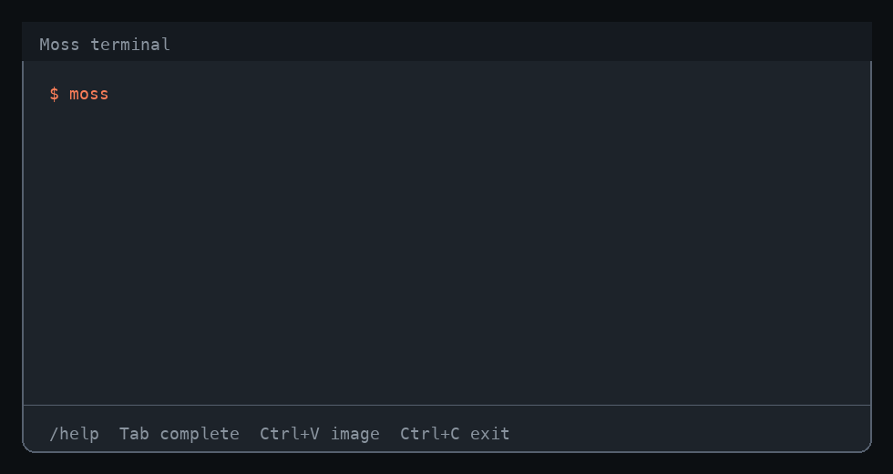
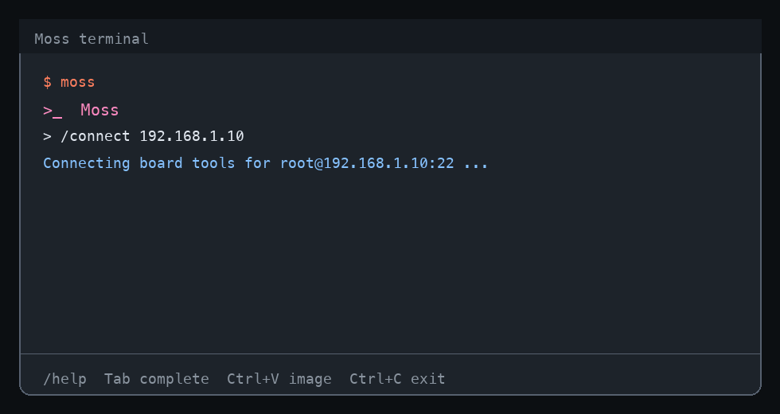

# Moss

**Moss is an open, robotics-aware terminal agent and embeddable agent runtime developed by 地瓜机器人 (D-Robotics).** Install `moss` and start with the built-in D-Robotics model gateway; community login is optional. When you want your own model, billing, data boundary, or private gateway, switch to any OpenAI-compatible endpoint or Anthropic without changing the agent.

`moss` is the primary CLI command. `dmoss` remains a compatible alias for existing users and scripts.

<p align="center">
  
</p>

<p align="center">
  
</p>

## Why Moss?

Moss gives you the familiar terminal-agent loop from Claude Code and Codex, but with a different ownership model:

- **Bring your own model** - DeepSeek, Qwen, OpenAI-compatible gateways, Anthropic, or self-hosted endpoints.
- **Use it immediately** - the built-in D-Robotics gateway works without a model API key or forced community login.
- **Work with robots and edge devices** - `/connect <ip>` adds RDK board SSH, diagnostics, and ROS2 tools inside the same session.
- **Embed it in your own product** - Moss is a runtime with public contracts, not only a closed standalone app.
- **Stay honest about evidence** - Moss is prompted to separate verified facts, reasonable inferences, and unverified assumptions, and to say when CodeGraph, device access, or other evidence is unavailable.
- **Grow reusable skills** - Moss can install workspace skills into `.moss/skills/<name>/SKILL.md` through the approved `install_skill` tool, then rediscover them in later runs.
- **Keep the first screen usable** - focused slash commands, image/file attachment, goals, compaction, sessions, MCP, skills, and sub-agents stay available without turning `/help` into a wall.

If that direction is useful, star the repo to follow the open runtime, fork it to build your own host, and open issues for model providers, board workflows, or host-adapter gaps you want Moss to support.

## Moss Vs Claude Code And Codex

| Capability | Moss | Claude Code | Codex |
| --- | --- | --- | --- |
| Interactive terminal agent | `moss` (`dmoss` alias) | yes | yes |
| Default first run | Built-in D-Robotics gateway, no model key or forced login | Anthropic account | OpenAI account |
| Bring your own model | OpenAI-compatible, Anthropic, private gateways, self-hosted models | limited to Anthropic path | limited to OpenAI path |
| Robotics / board workflows | First-class RDK board connect, SSH, diagnostics, ROS2 tool path | general developer agent | general developer agent |
| Embedding model | Public Host Adapter contract and npm packages | standalone product | standalone product |
| Product control | Host owns UI, tools, storage, approvals, credentials, telemetry | vendor-owned app | vendor-owned app |

Claude Code and Codex are excellent polished standalone assistants. Moss is for people who want that style of agent while also owning the runtime, model route, device tools, and product integration surface.

## Install

```bash
npm i -g @rdk-moss/agent@latest
moss
```

The npm package is `@rdk-moss/agent`. The command is `moss`. Existing `dmoss` commands still work.

Optional: run `moss auth login` when you want to link a D-Robotics developer community account. It is not required for normal first use.

Every plain `moss` launch starts a **new saved conversation**. Resume only when you ask for it:

```bash
moss resume --last
moss resume --session <session-key>
moss --session <session-key>
```

Update anytime:

```bash
npm i -g @rdk-moss/agent@latest
# or from inside Moss:
/update
```

## Five-Minute Tutorial

1. Open a project:

   ```bash
   cd my-project
   moss
   ```

2. Ask for a read-only orientation:

   ```text
   Inspect this repo and tell me the build, test, and release path.
   ```

3. Check the current runtime state:

   ```text
   /status
   /model
   ```

4. Attach context:

   ```text
   /attach ./screenshot.png
   /attach ./notes.txt
   What is wrong in this UI?
   ```

   On the full macOS TUI, copy a screenshot and press `Ctrl+V`; Moss attaches it as `[Image #1]` for the next prompt.

5. Give Moss a concrete task:

   ```text
   Fix the failing test, explain the root cause, and run the narrowest verification.
   ```

Moss asks before file writes, commands, and external actions unless you explicitly choose a more autonomous approval profile.

## Honest Runtime Capabilities

Moss now tells the model what is actually available in the current run before it starts working:

- The system prompt includes the registered tool names for this run, so Moss should not invent tool names or claim unavailable capabilities.
- CodeGraph guidance is conditional: if `codegraph_*` MCP tools are registered, Moss can prefer structural navigation; otherwise it must say CodeGraph is unavailable and fall back to listed tools such as `search_code`, `search_files`, `list_directory`, and `read_file`.
- The behavior contract explicitly asks Moss to be 实事求是: separate verified facts from inference and assumptions, report missing evidence, and avoid filling unknown gaps just to sound confident.

## Skills

Moss discovers `SKILL.md` files under `.moss/skills/`, `.moss/agent/skills/`, legacy `skills/` and `agent/skills/`, and configured extra skill directories. Built-in workflow skills cover methodical building, debugging, test-driven changes, migration safety, and CodeGraph navigation when available.

Moss can also install a new workspace skill itself through the `install_skill` tool. The tool writes a frontmatter-backed `SKILL.md` under `.moss/skills/<name>/SKILL.md`, is treated as a workspace write, and therefore goes through the normal approval policy.

Example prompt:

```text
Turn the workflow we just used into a reusable Moss skill. Install it as a low-risk skill and include the trigger phrases we used.
```

## Use Your Own Model

The built-in D-Robotics gateway is for instant first use. Configure your own provider when you need your own account, billing, private gateway, data-local deployment, or a self-hosted model. Your model config overrides the built-in gateway.

Guided setup:

```bash
moss setup
moss auth status
```

Environment variables:

```bash
export DEEPSEEK_API_KEY=...
# or: export OPENAI_API_KEY=...
# or: export ANTHROPIC_API_KEY=...
# or: export DASHSCOPE_API_KEY=...
moss
```

Private OpenAI-compatible gateway:

```bash
export OPENAI_API_KEY=...      # or DMOSS_API_KEY=... for a generic gateway key
moss config set provider openai-compatible
moss config set model <your-model>
moss config set baseUrl https://llm.example.com
moss auth status
moss
```

`baseUrl` is the API root, not the full chat endpoint. Do not include `/chat/completions`. Both `https://llm.example.com` and `https://llm.example.com/v1` are accepted; Moss calls `/v1/chat/completions` for OpenAI-compatible providers.

Configuration priority is: CLI flags and `-c key=value` > environment variables > `moss config` / `moss setup` > built-in gateway. If multiple provider keys are set in your shell, set `DMOSS_PROVIDER` explicitly.

Inside Moss, use `/model` to list models from the active provider when available, choose by number, or type `/model <model-name>` for a custom model.

## Connect An RDK Board

Use `/connect` inside a live session; no restart is required:

```text
/connect 192.168.1.10 --user root
/status
Check camera, ROS2 nodes, disk space, and device health.
```

After connection, Moss can route board diagnostics through the active device tool group while keeping the conversation context. The host still controls SSH credentials, approval policy, protected paths, and available device tools.

## Attach Images And Files

```text
/attach ./screenshot.png
/attach ./camera-frame.jpg
/attach ./error.log
Explain what you see and propose the next debug step.
```

Images (`png`, `jpg`, `jpeg`, `gif`, `webp`) are sent as model image blocks when the active provider/model supports vision. Text files are inserted as prompt context. Use `/attach list` to review pending attachments and `/attach clear` to discard them before sending.

## Build With Moss

Only using the CLI? You can stop here.

Building a product or service that embeds Moss? Scaffold a host project:

```bash
npx create-dmoss-app my-host
```

Embed into an existing product host by installing the packages, registering providers / tools / storage / approval gates / event sinks, publishing a `MossHostRuntimeManifest`, and running `evaluateMossHostCompatibility()` in CI. This is useful when you want Moss inside your own IDE, robot console, browser app, desktop app, or device platform instead of only as the `moss` terminal command - see [Integrating Moss Into A Host](#integrating-moss-into-a-host).

## Automation And Safety

For unattended benchmark or CI runs, choose an explicit approval policy before starting:

```bash
DMOSS_CLI_AUTO_APPROVE=1 moss --workspace-write "write and verify the tool"
# or persist a broader local policy:
moss config set profile autonomous
```

`DMOSS_CLI_AUTO_APPROVE=1` only approves tools that pass the active safety policy. It does not bypass `--read-only`, `deniedTools`, protected paths, or workspace sandbox checks. For browser-driven real websites, use `--full-access` because `web_browser_control` is classified as an external interaction.

Moss exposes two browser tools when a local Chrome/Chromium executable is available: `web_browser_fetch` for read-only JavaScript-rendered pages and `web_browser_control` for approved browser workflows. `@rdk-moss/agent` uses `puppeteer-core`, so it does not download a browser during install. If auto-discovery cannot find one, set:

```bash
export DMOSS_BROWSER_EXECUTABLE="/path/to/chrome-or-chromium"
```

## Repository Scope

This repository contains the parts of Moss that can be maintained independently
from a product shell.

| Package | Role |
| --- | --- |
| `@rdk-moss/core` | Public contracts, platform extension types, Host Adapter contract, and robotics prompts |
| `@rdk-moss/agent` | Agent runtime, tool loop, context management, safety helpers, skills, and provider adapters |
| `@rdk-moss/memory` | Context-aware memory selection and memory draft helpers |
| `@rdk-moss/skills` | Skill learning, validation, scoring, and promotion helpers |
| `@rdk-moss/teaching` | Teach-while-solve annotations and tool digest helpers |
| `create-dmoss-app` | Minimal project scaffolding for external Moss users |

Product hosts are outside this repository.

## Architecture

If you only use `moss`, you can skip this section. It exists for teams that
embed Moss into a larger product.

Moss is split around a narrow host boundary:

```text
Product host
  - model keys and provider configuration
  - UI, native shell, persistence, telemetry
  - local workspace and device access
  - product tools and external channels
  - domain knowledge packages
        |
        | Host Adapter manifest + runtime injection
        v
Moss packages
  - agent loop and tool execution pipeline
  - context, memory, skills, and teaching primitives
  - host-neutral safety helpers
  - public extension contracts
```

The agent runtime should not import product code. Product hosts inject concrete
providers, tools, storage, approval handling, knowledge modules, and event
transports.

## Host Adapter Contract

The public contract lives in:

```ts
import {
  MOSS_HOST_ADAPTER_CONTRACT_VERSION,
  evaluateMossHostCompatibility,
  type MossHostRuntimeManifest,
} from '@rdk-moss/core/contracts/host-adapter';
```

A host declares:

- Host id, name, and version.
- Moss package versions it is consuming.
- Capabilities such as `llm_provider`, `tool_registry`, `approval_gate`,
  `event_sink`, `memory`, `knowledge`, `device_runtime`, and `channel_runtime`.
- Provider families supplied by the host.
- Tool names and permission boundaries.
- Event schemas and knowledge modules.

Moss releases use `evaluateMossHostCompatibility()` to decide whether the host
can consume the release unchanged.

Read the detailed contract guide:

- [`docs/host-adapter-contract.md`](docs/host-adapter-contract.md)

## Project Goal And Roadmap

Moss is being developed as a robotics-grade, host-neutral agent runtime. The
roadmap defines the north star, non-goals, six-month target, and phase plan:

- [`docs/roadmap.md`](docs/roadmap.md)

## Maintainer Guides

These documents are intended to be durable project manuals, not session notes:

- [`AGENTS.md`](AGENTS.md): agent working rules, architecture-review discipline,
  CodeGraph usage, and bug-fix checklists for this repository.
- [`ARCHITECTURE_ASSESSMENT.md`](ARCHITECTURE_ASSESSMENT.md): current
  architecture findings, rejected hypotheses, and "do not change" decisions.
- [`CLEAN_CODE_ASSESSMENT.md`](CLEAN_CODE_ASSESSMENT.md): code quality review
  and cleanup guidance.
- [`docs/host-adapter-contract.md`](docs/host-adapter-contract.md): Host
  Adapter contract guide.
- [`docs/tool-runtime.md`](docs/tool-runtime.md): tool execution pipeline,
  ownership boundaries, hooks, approval, timeout, and guard limits.
- [`docs/tool-side-effect-idempotency-rfc.md`](docs/tool-side-effect-idempotency-rfc.md):
  RFC for in-flight deduplication of non-idempotent tools.
- [`docs/release-checklist.md`](docs/release-checklist.md): release validation
  and host update checklist.

Historical phase notes such as [`docs/goals-phase-5.md`](docs/goals-phase-5.md)
and [`docs/goals-phase-6.md`](docs/goals-phase-6.md) can help explain why the
current contracts and tests exist, but the roadmap and release checklist are the
source of truth for new work.

## Architecture Review Discipline

Do not turn open-ended reviews into endless issue lists. A candidate issue is
worth fixing only when it blocks a committed goal, a real host path, safety,
data correctness, resource lifecycle, or a contract that downstream users rely
on. Style concerns, framework feature comparisons, and speculative future
abstractions should be recorded as observations or rejected explicitly.

Before changing architecture, preserve this loop:

1. Generate hypotheses from the actual code and active host workflows.
2. Try to falsify each hypothesis by reading source, checking callers, tracing
   runtime flow, or running a focused test.
3. Fix bugs with declare + enforce + test. Existing tests are regression
   checks; the fix still needs a test that would have failed before the change.
4. Document "do not touch" conclusions when a suspicion is falsified, so future
   reviews do not spend time re-litigating the same point.

## What Does Not Belong In Moss

Keep product-specific code in the host repository.

Do not add:

- Product-host `server/**`, `src/**`, or native-shell code.
- Product configuration defaults, local sessions, logs, or generated desktop
  artifacts.
- Supabase keys, model keys, image provider keys, device passwords, SSH
  credentials, or user account details.
- Host-owned integrations such as board deployment, external chat channels,
  desktop IPC, native packaging, or product settings UI.
- Built `dist/` directories as tracked source.

RDK-specific domain knowledge may live in a separate optional package. The Moss
core packages should stay useful to other robotics or device-product hosts.

## Development

Use Node 22.16 or newer for this workspace.

Moss is verified on Ubuntu, macOS, and Windows in CI. Device and ROS tools are
optional runtime capabilities: they require host-side `ssh`/`sshpass` when
configured, and execute Linux commands on the remote device rather than on the
developer workstation.

```sh
npm install
npm run verify
```

`npm run verify` runs:

1. Open-source boundary checks.
2. Workspace hygiene checks for Node engine consistency, package test scripts,
   and local Markdown links.
3. Workspace builds.
4. Typechecks.
5. Package tests.

The boundary check can be run directly:

```bash
npm run check:boundaries
```

## Integrating Moss Into A Host

1. Install or vendor the relevant Moss packages.
2. Keep credentials and product-specific defaults in the host.
3. Register host providers, tools, storage, approval gates, and event sinks with
   the agent runtime.
4. Publish a `MossHostRuntimeManifest` from the host adapter.
5. Run `evaluateMossHostCompatibility()` in CI before adopting a new Moss
   release.

For a downstream product host, the host adapter lives in that host repository
and should be validated by its own Moss upgrade flow.

## Version Policy

Moss follows semver for the public package surface.

- Patch releases fix bugs or improve internals without requiring host adapter
  changes.
- Minor releases may add optional fields, optional capabilities, or new helper
  APIs. Existing hosts should continue to work.
- Major releases may change required Host Adapter fields or required
  capabilities. Hosts must update their adapter before adopting the release.

For downstream product hosts, a Moss patch or minor update should normally be a
submodule/package update plus validation. Adapter changes are required only when
`MOSS_HOST_ADAPTER_CONTRACT_VERSION` changes incompatibly or a release declares
new required host capabilities, event schemas, or provider families.

## Release Checklist

Every Moss release must pass the release checklist:

- [`docs/release-checklist.md`](docs/release-checklist.md)

At minimum, maintainers run:

```bash
npm run verify
npm run smoke:moss-cli
```

If the release is intended for a downstream host, update its Moss dependency or
vendored subtree and run the host upgrade verification there.
